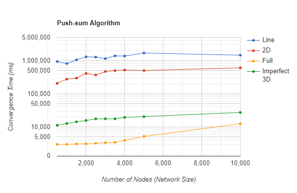

# Gossip-Pushsum-Communication
#### Academic Project
This project simulates the gossip and push-sum distributed communication algorithms using F# and the Akka framework. The gossip
algorithm and push-sum algorithm are run on various network topologies. The convergence time for
both methods is calculated for four different network topologies (Line, 2D Grid, Imperfect 3D
grid, Full).

## Convergence Time
### Gossip Algorithm

### Push-sum Algorithm

